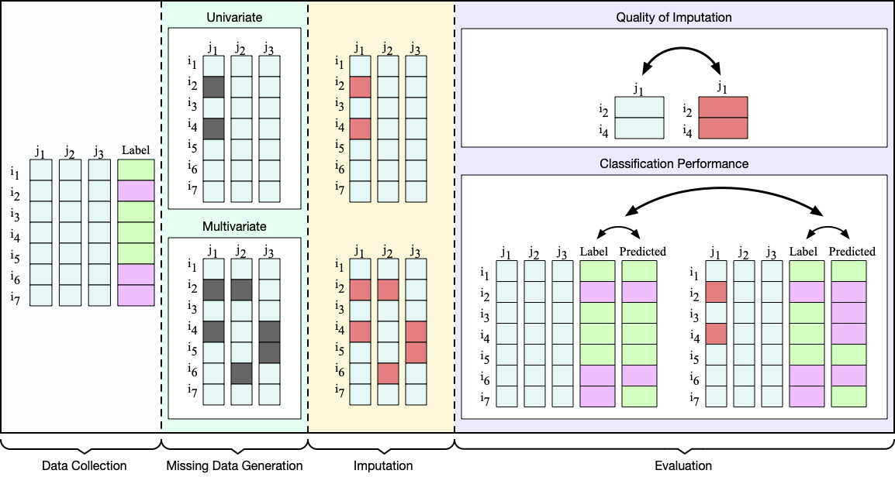

# Generating Synthetic Missing Data
This library contains several routines to **generate synthetic missing data**:

- Missing values can be inserted in only one feature (**univariate** configuration) or in several features (**multivariate** configuration);
- Implementation considers the 3 existing missing mechanisms: **MCAR** (Missing Completely At Random), **MAR** (Missing At Random), and **MNAR** (Missing Not At Random);
- Additional **atypical** configurations are also added for experimentation.

The details of the implementations, including their known pitfalls and limitations can be found in:

- Santos, M. S., Pereira, R. C., Costa, A. F., Soares, J. P., Santos, J., & Abreu, P. H. (2019). [Generating synthetic missing data: A review by missing mechanism.](https://ieeexplore.ieee.org/abstract/document/8605316) IEEE Access, 7, 11651-11667. [Full Paper here.](paper/Santos2019.pdf)





## Example of use:
The code is structured as follow:

- `univa` folder contains the set of routines to create univariate MCAR, MAR, and MNAR configurations;
- `unifo` folder contains the set of routines to create multivariate MCAR, MAR, and MNAR configurations;
- `atypical` folder contains the set of routines to generate specific domain-based missing data generation approaches;
- `utils`, `correlation`, and `toolboxes` folders contain helper files;
- The input for each implementation may vary depending on the approach to generate synthetic missing data. Please refer to the docstring of each implementation for details regarding input, output, and examples.

Here's an example for `MCAR1unifo generation:

```matlab
% Import necessary libraries
addpath('arff-to-mat');
addpath(genpath('univa'));
addpath(genpath('unifo'));
addpath(genpath('atypical'));
addpath(genpath('data'));
addpath(genpath('correlation'));
addpath(genpath('utils'));
addpath(genpath('toolboxes'));

% Example MCAR1unifo
X = rand(100,4);
missing_percentage = 20;
synth_X = MCAR1unifo(X, missing_percentage);
sum(isnan(synth_X))
sum(sum(isnan(synth_X))) / (size(X, 1) * size(X, 2)) * 100
```

Example output:

```matlab
>> main
Warning: PATTERNS in risk of being all NaN: 2 
> In MCAR1unifo (line 101)
  In main (line 14) 

ans =

    20    16    18    27

ans =

   20.2500
```

## Citation Request:
If you plan to use this library, please consider referring to the following papers:

```
@article{Santos2019,
  title={Generating synthetic missing data: A review by missing mechanism},
  author={Santos, Miriam Seoane and Pereira, Ricardo Cardoso and Costa, Adriana Fonseca and Soares, Jastin Pompeu and Santos, Jo{\~a}o and Abreu, Pedro Henriques},
  journal={IEEE Access},
  volume={7},
  pages={11651--11667},
  year={2019},
  publisher={IEEE}
}
```
